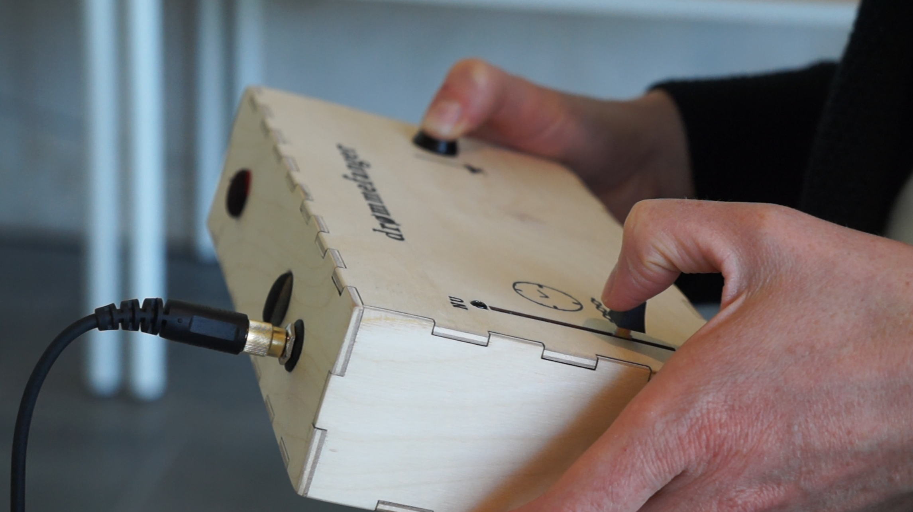
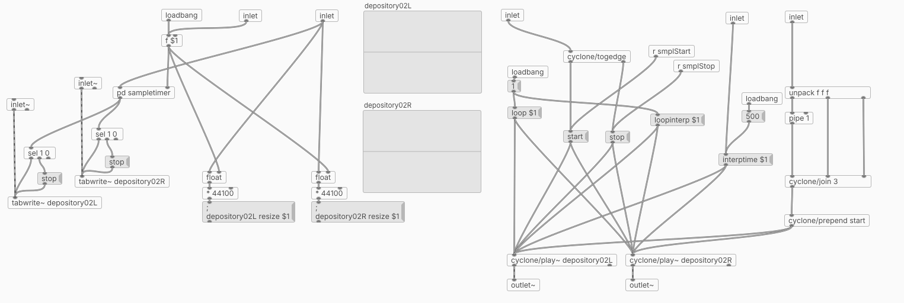
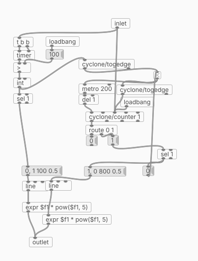
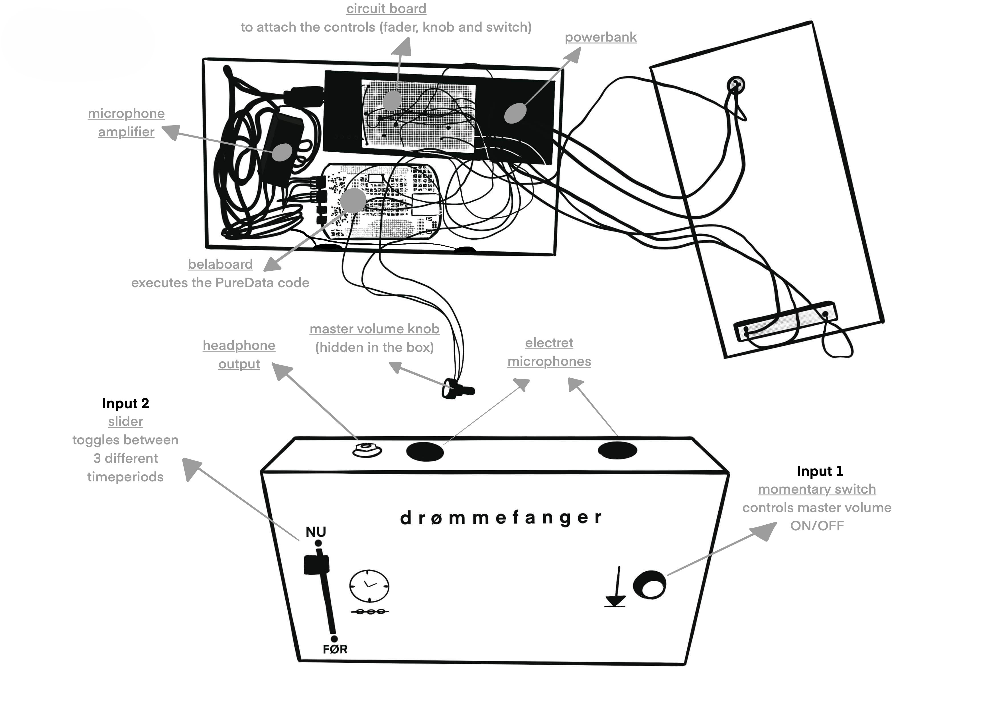

# capturing spaces / droemmefanger
## Concept and purpose
**capturing spaces** is a portable interactive sound installation which aims to activate the listeners awareness of the surrounding sound environment. This is done through live processing of the sounds around you. The concept evolves around enhancing the already present soundscape, while recording this soundscape into memory and replaying it randomly and according to some specific rules defined in the code. It is generating a *generative composition* of the past and present soundscape it is placed within. The goal is to make the listener intrigued and curious to venture around with the device and *interact* with the sound environments they find.

    
    

 

  <h3> Video </h3>

 

# How it works
On the back of the box two omnidirectional electret microphones is placed. They record the environment to a 30 second long buffer on the device inside the box. The system then chooses small snippets of sound within that buffer and plays it, while processing it with different effects and sample manipulations. What effects and what sound snippets is chosen is based on a randomizer that is defined in the code. On top of the generative sample buffer it also replays the 'present' soundscape live to the listener, adding different audio effects.

## Software
The programming of the system is done with the visual scripting language Pure Data which is specifically designed for signal programming and audio processing. The code is based on a *main* patch and several *abstractions* which the main patch is utilizing.

    <h3>_main.pd patch</h3>
    
    <h3>Examples on abstractions</h3>
    <h4>liveBufferingToolStereo~</h4>
    
    <h4>timeScrollParam~</h4>
    
    <h4>scrollAmplitudeParam~</h4>
    

## Hardware implementation
Using a belaboard which is compatible with Pure Data.
Potentiometers added to a breadboard connected to the belaboard. The potentiometers is converted from analog to digital signal and used to control the parameters in the code.

    <h3>Hardware sketch</h3>
    
    <h3>Inside the box</h3>
    

