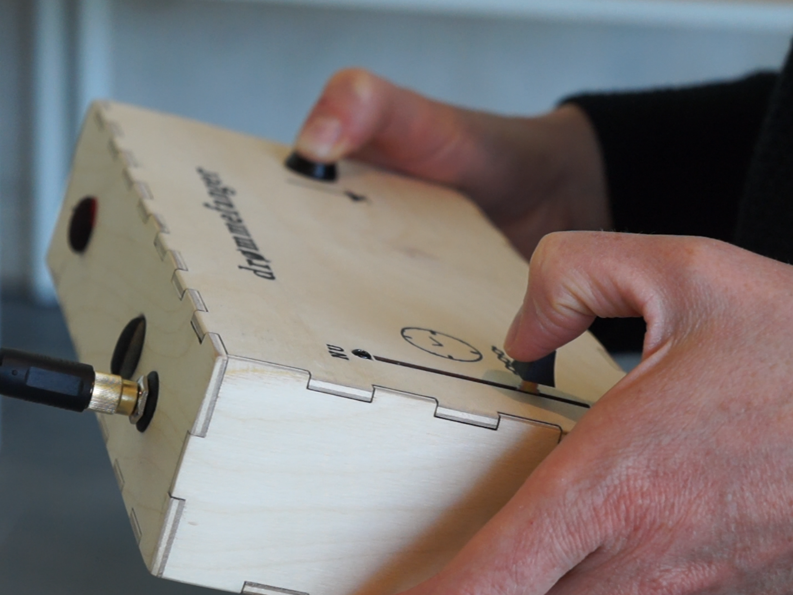
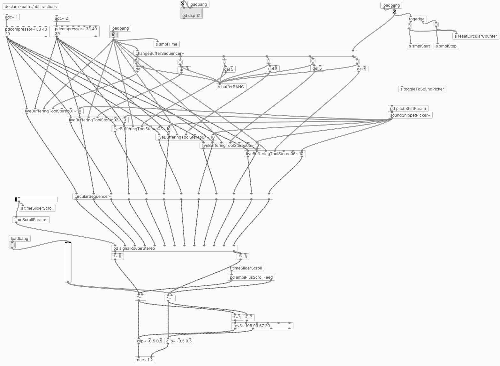
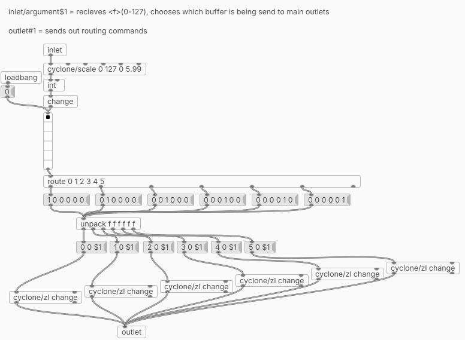

# Droemmefanger

*A portable interactive sound installation transforming the soundscape around the listener*
 
 

    

 

## Overview and Concept
**Droemmefanger** is a portable, interactive sound installation designed to create awareness towards the listeners surrounding soundscape environment. Through live sound processing it captures and manipulates the real world sounds in real-time. This is done through live processing where recorded sounds is processed and replayed randomly and according to some specific rules which is defined in the code.

The system is generating a generative composition of the past and present soundscape it is placed within.

The concept and goal of the installation is to encourage the listener to venture around with the device and interact with the various soundscape environments, transforming each location into a new and different sound experience.

*Droemmefanger was exhibited at Moesgaard Museum as part of MatchPoints 2022.*

 

## Table of Contents
1. [How It Works](#how-it-works)
2. [Hardware Implementation](#hardware-implementation)
3. [Software Implementation](#software-implementation)
4. [Video Demo](#video-demo)

 

    
    

 

## How It Works

**Droemmefanger** enhances the natural soundscape through live recording and randomized playback.

- Records ambient sounds and replay snippets in randomized intervals, with randomized audio manipulation effects applied.
- Generates new sound textures which consists of effect processed live sound with effect processed recorded sounds.

It functions as a generative sound composition tool, continuously evolving based on its placement and the ambient noise it records.

 

## Hardware Implementation

The system uses a **Belaboard**, compatible with Pure Data, as its main hardware controller. Key components include:
- **Microphones:** Two omnidirectional electret microphones for sound input.
- **Potentiometers:** Analog to digital converters that control parameters in the Pure Data patch.
- **Breadboard and Wiring:** Custom wiring setup to connect the Belaboard and potentiometers.

*Droemmefanger* use the microphones attached to the back of the device to capture the surrounding sound. The beloboard then plays the captured audio in real-time + it records a continuous 30-second sound buffer.

The potentiometers control if the patch is muted + what part of the sound buffer the code is using to create the generative composition.

### Hardware Sketch

    

### Inside the Box

    

 

## Software Implementation

The system is developed using **Pure Data (Pd)**, a visual programming language suited for real-time sound processing. The program is structured into a main patch and several *abstractions* which the main patch is utilizing:

## Main Patch

    <h3>_main.pd patch</h3>
    

 

## Key Abstractions

    <h4>liveBufferingToolStereo~</h4>
    
    <h4>timeScrollParam~</h4>
    
    <h4>scrollAmplitudeParam~</h4>
    

 

  <h2> Video Demo </h2>

  

  [Watch the video demo on YouTube](https://www.youtube.com/watch?v=Zv3LVDvMo8s)

